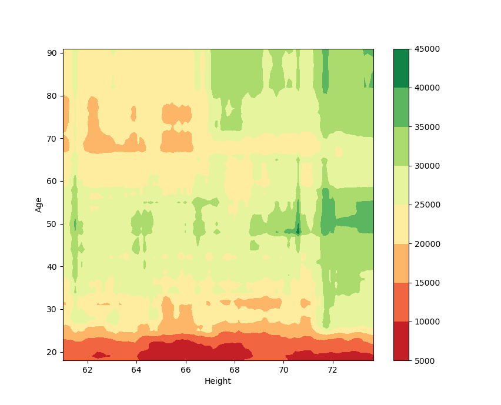

# CPD - Complex Partial Dependence for Scikit-learn


## About PhiMD

CPD is a small Python module which generates partial dependence graphics and
tables for models.

## Motivation and Use Cases
Many Machine Learning models manipulate categorical variables which are
typically encoded using one-hot encoding, thus transforming each of such
variables into a set of logical variables (one for each of the categories in the
original data). In order to have a proper glimpse on the model's partil response
to such a categorical variable, one must evaluate the partial dependence with
respect to each of the columns created by the one-hot encoding, while applying
adequate constraints on the other "sister columns".

CPD eases the construction of such partial dependence data, by using
[Scikit-learn](https://scikit-learn.org)'s implementation of the partial
dependence function (future versions might do a complete re-implementation of
this, for improved performance). CPD allows enquires of the partial dependence
in the following cases:
1. one categorical variable
2. two categorical variables
3. two real variables
4. one categorical variable _versus_ one real variable
5. a set of real variables closely related

Examples of these five cases are given in the ```examples``` folder. The first
three use cases are self-evident. The forth case compares the model's response
with respect to one variable for each of the possible values of a categorical
variable.

The final case has a prticular application in chemistry, but similar cases can
be conceived in other fields. Let's suppose our model predicts a given property
based on some spectroscopic data (for example, the infrared spectra). The
infrared data used in the model is usually a sampling of the absorvance at given
values of the wavelenght and might be represented by a large number of variables
named, for example, *IR_610*, *IR_611*, etc, were the number after the last
underscore marks the position in the spectrum. CPD allows one to have a "bird's
eye" view of the model's partial dependence on the IR sepctrum as a whole by
combining the individual responses of each of the *IR_* variables.

An unintended advantage of using CPD is the possibility of saving the partial
dependence object itself (using ```pickle```, for example). This allows for
separation between calculating the partial dependence data (usually a
computationally expensive procedure) and rendering it in the form of tables,
graphics, etc.

## System Requirements
PhiMD is written in Python, and should work with any recent python distribution,
although version 3.6 and above is highly recommended. It also needs some
additional modules, which can be intalled using pip or your operating system's
package management:
* [Numpy](https://numpy.org/)
* [Pandas](https://pandas.pydata.org/)
* [Scikit-learn](https://scikit-learn.org)

## Instalation
In order to use CPD, you just need to have a copy of cpd.py on your project's
folder and import it to your code. 

Alternatively, you can clone this repository and use setuptools:

```
python setup.py
```

If you whish to further edit this work, you might prefer to put a linked version
of ```cpd.py``` on your PYTHON_LIB_PATH, using:

```
cd cpd
pip install -e .
```

## How to Use
After importing, the ```cpd.Partial_Dependence``` class becomes available. This
class is initialized using a similar nomenclature to that of
[Scikit-learn](https://scikit-learn.org)'s. The examples bellow are adapted from
the ones you can find in the ```examples``` folder.

### Partial dependence on one categorical variable (1DCPD)
In this example, our model is a regressor of _earn_ (Real) wiht respect to
_height_ (R),_sex_ (Categorical),"ed" (Integer),"age" (I), and "race"(C). For
the purpose of CPD, Integer variables are automatically converted into Real.
```
from cpd import Partial_Dependence

pd_data = Partial_Dependence(myModel, X, ['race'])

# print will print an ascii table of the model
print(pd_data)

# we can save the data as a csv file
pd_data.to_csv('model_response_race.csv')

# finally, we can plot the data using matplotlib
pd_data.plot()

```

When using one categorical variable, the partial dependence is ploted as a bar
graph.


### Partial dependence on two categorical variables (2DCPD)
Again, our model is a regressor of _earn_ (R) wiht respect to
_height_ (R),_sex_ (C),"ed" (I),"age" (I), and "race"(C), with the integer
variables being automatically converted to reals.
```
from cpd import Partial_Dependence

pd_data = Partial_Dependence(myModel, X, ['sex','race'])

# print will print an ascii table of the model
print(pd_data)

# we can save the data as a csv file
pd_data.to_csv('model_response_race.csv')

# finally, we can plot the data using matplotlib
pd_data.plot()

```

When using two categorical variables, the partial dependence is ploted as a
heatmap, with a colorbar showing the magnitude of the model's response.


### Partial dependence on two real variables (2DRPD)
Again, our model is a regressor of _earn_ (R) wiht respect to
_height_ (R),_sex_ (C),"ed" (I),"age" (I), and "race"(C), with the integer
variables being automatically converted to reals.
```
from cpd import Partial_Dependence

pd_data = Partial_Dependence(myModel, X, real_features = ['height','age'])

# print will print an ascii table of the model
print(pd_data)

# we can save the data as a csv file
pd_data.to_csv('model_response_height_age.csv')

# finally, we can plot the data using matplotlib
pd_data.plot()

```

When using two real variables, the partial dependence is ploted as a
heatmap, with a colorbar showing the magnitude of the model's response.



### Partial dependence on a real variable, conditioned by a categorical one (2DCRPD)
Again, our model is a regressor of _earn_ (R) wiht respect to
_height_ (R),_sex_ (C),"ed" (I),"age" (I), and "race"(C), with the integer
variables being automatically converted to reals.
```
from cpd import Partial_Dependence

pd_data = Partial_Dependence(myModel, X, real_features = ['sex','age'])

# print will print an ascii table of the model
print(pd_data)

# we can save the data as a csv file
pd_data.to_csv('model_response_sex_age.csv')

# finally, we can plot the data using matplotlib
pd_data.plot()

```

When using two real variables, the partial dependence is ploted as a
heatmap, with a colorbar showing the magnitude of the model's response.


### Partial dependence of a set of real variables (MDRPD)
The following examples us the data in the ```examples/compound_activity.csv```
file, which contains simulated data of the activity of different
compounds/formulations with respect to their UV/Vis spectra. The data contains
one column for the Activity, followed by 230 columns denoted *Spec_NNN*, where
*NNN* is an integer number shown the compounds absorvance at *NNN* nanometers,
between 180 and 410 nm.

In the first example, we have a view of the model's dependence on all the UV/Vis
spectrum. For this, we place only one string in the list of real features,
containing the most exclusive common start for the name of all columns of
interest. CPD automatically searches for the columns in the data matching this
string and extracts the *xx* positions from their suffix integers.

```
from cpd import Partial_Dependence

pd_data = Partial_Dependence(activityModel, X, real_features = ['Spec'])

# print will print an ascii table of the model
print(pd_data)

# we can save the data as a csv file
pd_data.to_csv('activity_versus_spectra.csv')

# finally, we can plot the data using matplotlib
pd_data.plot()

```

In this mode, the partial dependence is ploted as a heatmap, with the *xx* axis
being extracted from the digits after the last underscore in the names of the
selected columns, the *yy* axis showing the magnitude of the data at that point
(in this example, the Absorvance) and a colorbar showing the magnitude of the
model's response.


In the picture above, we notice that most of the interesting stuff is happening
in the region between 250 nm and 300 nm, so we can have CPD do a partial
dependence run only the columns containing data for that section of the
spectrum. To do this, the explicit name of all columns of interest must be
supplied to ```cpd.Partial_Dependence```. A nice way to do this is by using list
comprehension.

```
from cpd import Partial_Dependence

cols = [f"Spec_{x}" for x in range(250,300)]

pd_data = Partial_Dependence(activityModel, X, real_features = cols)

# print will print an ascii table of the model
print(pd_data)

# we can save the data as a csv file
pd_data.to_csv('activity_versus_spectra.csv')

# finally, we can plot the data using matplotlib
pd_data.plot()

```

Because the name for the *xx* axis is automatically generated from the common
start of all columns, the labeling might not be as correct as intended.
Fortunatelly, we can use the MatPlotLib's interactive window to make some
adjustments on the scales and labels and end with this result:


## Whishlist
These are some features planned for the near future:
* Export response as a Pandas dataframe.
* Export partial dependence as a LaTeX table.
* Output a barebones gnuplot code for making the plots.
* Save the plot without entering MatPlotLib's interactive window.

## How to Cite
If you find CPD usefull for your research, please cite this gitHub repositoty.
using the following text: F. Teixeira, *CPD - Complex Partial Dependence for
Scikit-learn*, **2020** (https://github.com/teixeirafilipe/cpd). This citation
string is available as ```cpd.cite```. 
The following BibTeX entry should provide you with all the needed information
(also available on the module as ```cpd.bibtex```):

```
@Electronic{Teixeira2020CPD,
  author    = {Filipe Teixeira},
  title     = {CPD - Complex Partial Dependence for Scikit-learn},
  year      = {2020},
  date      = {2020-12-19},
  url       = {https://github.com/teixeirafilipe/cpd},
  urldate   = {2021-01-04}
}
```


